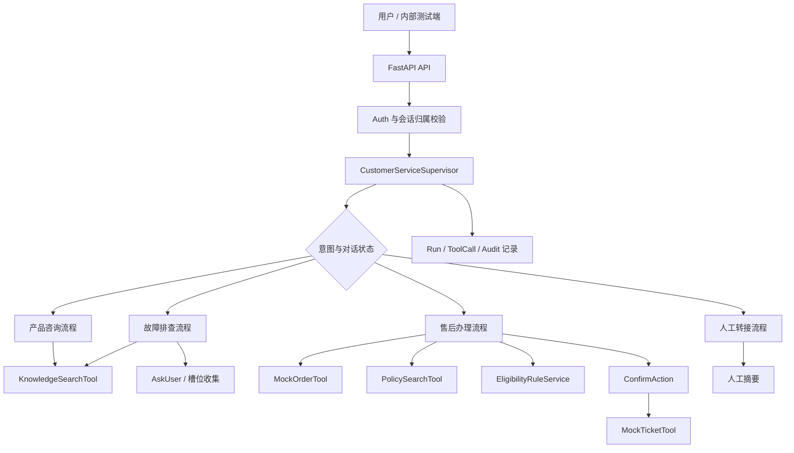
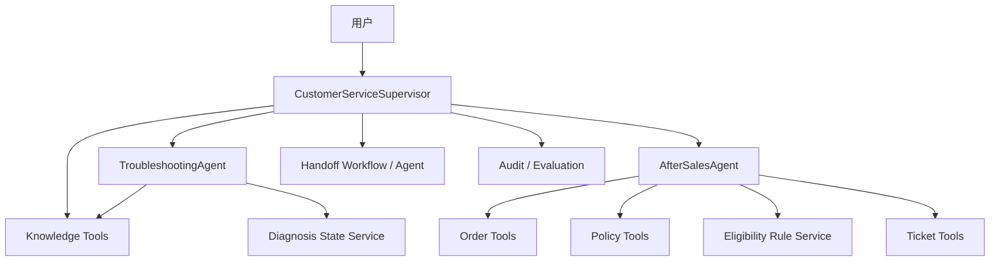

# QA-agent 多智能体客服演进总体方案

| 项目 | 内容 |
| --- | --- |
| 文档状态 | 已确认方案基线 |
| 创建日期 | 2026-05-26 |
| 项目展示名称 | `QA-agent` |
| 适用仓库路径 | `E:\myProgram\QA_agent` |
| 当前目标 | 内部试用级客服系统 |
| 长期目标 | 可治理、可审计、可扩展的企业级多智能体客服平台 |
| 第一期闭环 | 产品咨询 + 故障排查 + 模拟订单/售后办理 + 转人工 |
| 配套任务台账 | `docs/worklists/customer-service-multi-agent-worklist.md` |

## 1. 文档目的

本文档定义 `QA-agent` 从现有 RAG 客服原型演进为内部试用级、并最终具备企业级扩展能力的总体方案。文档与产品展示统一使用 `QA-agent`；Python 包、容器和配置中的技术标识可按运行约束使用 `qa_agent` 或 `qa-agent`。它覆盖目标边界、架构原则、一期业务流程、数据/API/安全/评测设计、多智能体拆分时机以及实施路线。

本文档用于指导后续方案评审与实施计划编写，不等同于已完成的代码实现。开发进度及验收结果统一记录在配套 worklist 中。

## 2. 当前项目基线

### 2.1 已存在的能力

当前仓库已经完成一条基础问答调用链：

```text
HTTP API
  -> CustomerServiceAgent
     -> ChatService (LLM)
     -> search_faq Tool
        -> VectorStore (Chroma)
           -> EmbeddingService
  -> ConversationManager
     -> PostgreSQL
```

代码层已经存在的主要能力如下：

| 能力 | 当前实现 | 位置 |
| --- | --- | --- |
| API 服务 | FastAPI 服务、聊天和会话接口 | `main.py`、`apps/customer_service/routes.py` |
| LLM 调用 | OpenAI 兼容接口、错误封装、同步/流式方法 | `llm/client.py` |
| FAQ 检索 | Chroma 向量检索、Embedding 调用 | `infrastructure/rag/` |
| 工具抽象 | `Tool`、`ToolParameter`、FAQ 检索工具 | `tools/` |
| Agent 循环 | 文本 ReAct 形式的 `search_faq` 与 `Finish` 调度 | `domain/customer_service/agent.py` |
| 会话持久化 | PostgreSQL 会话与消息存储 | `utils/conversation.py`、`infrastructure/models.py` |
| 知识数据 | 智能门锁、摄像头、网关、售后政策 FAQ | `实训文档/` |

### 2.2 经核查的运行现状

2026-05-26 对当前本地环境的只读/替身验证结果：

| 核查项 | 结果 |
| --- | --- |
| 项目自带 `.venv` 下模块导入 | 通过 |
| `main.py` 导入 | 通过 |
| 本地 Chroma FAQ 数据 | 存在 83 条记录 |
| PostgreSQL 连接 | 可连接，端口为本地配置的 `5433` |
| 当前数据库会话数据 | 已存在会话与消息数据，说明链路曾实际运行 |
| `search_faq -> Finish` 控制流 | 使用内存替身验证通过 |
| `AskUser` 控制流 | 尚未实现，输出会被当作未知工具并走兜底 |

### 2.3 当前缺口

| 类别 | 缺口 | 影响 |
| --- | --- | --- |
| 能力一致性 | README 声称主动反问，但代码未实现 `AskUser` | 用户体验与文档承诺不一致 |
| 回答可信度 | 回答未对外返回结构化引用 | 无法向用户或客服证明答案依据 |
| 对话协议 | 仅支持 `final_answer` 实际行为 | 无法表达澄清、确认写操作、转人工 |
| 业务办理 | 无订单、资格规则、工单模型及工具 | 只能答 FAQ，不能完成售后闭环 |
| 权限安全 | 未实现用户身份与会话/订单隔离 | 不适合真实用户试用 |
| 可观测性 | 缺少工具调用、决策结果、评测记录 | 难以运营和排错 |
| 工程基线 | 配置变量、Docker 端口、文档、导入脚本存在不一致 | 新环境复现不稳定 |
| 健康状态 | `/health` 不验证依赖；初始化错误可被吞掉 | 服务可能假健康 |
| 架构演进 | 当前工具和 Agent 边界较基础 | 需先规范协议再拆多 Agent |

## 3. 建设目标与范围边界

### 3.1 第一期建设目标

第一期将系统建设为内部试用级客服 MVP，满足以下闭环：

1. 用户咨询产品功能或售后政策，系统基于知识库给出带来源回答。
2. 用户描述产品故障，系统能主动补充询问型号或现象，随后给出排障步骤。
3. 用户提出退换或维修需求，系统能查询模拟订单，依据确定性规则判断资格。
4. 系统在用户明确确认后创建模拟售后工单。
5. 无法可靠处理、用户主动要求或风险升级时，系统转人工并生成摘要。
6. 内部人员可复盘会话、工具调用、判断结果和评测结果。

### 3.2 长期目标

长期目标是企业级多智能体客服平台：

- 接入真实客户、设备、订单、物流、售后和人工客服系统。
- 以 Supervisor 为总控，以业务领域 Agent 为专业处理单元。
- 具备身份权限、多租户隔离、审计、监控、评测、知识治理与灰度能力。
- 对关键写操作和高风险判断保持规则校验及人工控制。

### 3.3 第一期不做的事项

为控制风险和验证闭环，第一期明确不包含：

- 不直接连接生产订单、工单或用户系统。
- 不将每个数据查询能力包装为自由推理子 Agent。
- 不自动执行退款、赔付、取消订单或更换设备等高风险操作。
- 不建设完整多租户商业化平台。
- 不以复杂多 Agent 编排替代尚未稳定的基础流程。

## 4. 核心设计原则

### 4.1 按业务职责拆 Agent，不按技术资源拆 Agent

RAG 检索、订单读取、规则判定、工单创建属于确定性能力，应设计为工具或服务。它们需要参数约束、权限检查、稳定响应和可审计结果。

故障诊断、售后办理、投诉升级等包含多轮信息收集和跨能力编排的业务流程，稳定后适合拆分为领域子 Agent。

推荐边界：

```text
总控 Agent：理解诉求、选择流程、汇总结果、控制对话
领域子 Agent：处理独立业务流程
Tools / Services：执行检索、查询、规则计算和受控写操作
```

### 4.2 Agent 负责编排，服务负责规则与写操作

- Agent 可以决定调用哪个已授权能力。
- 售后资格必须由规则服务计算，不由语言模型自行断言。
- 工单创建必须经过用户确认。
- 工具层必须校验权限、输入与结果状态。

### 4.3 回答必须有依据，无法证实时应降级

- 知识型答案必须返回来源文档和相关片段标识。
- 业务型答案必须返回订单事实、适用政策和规则结论。
- 没有有效依据时应澄清、拒答或转人工，不应自由编造。

### 4.4 保存业务轨迹，不保存模型完整思维链

系统应记录意图、调用的工具、工具结果摘要、引用来源、状态转移、办理动作和错误信息。不得持久化或展示模型完整内部推理文本。

### 4.5 先形成可测流程，再拆多智能体

一期先以 Supervisor + Workflow + Tools/Services 打通业务闭环。故障和售后流程经过评测后，才拆成 `TroubleshootingAgent` 与 `AfterSalesAgent`，确保拆分前后业务输出可以对照验证。

## 5. 总体系统架构

### 5.1 一期逻辑架构



### 5.2 一期组件职责

| 组件 | 类型 | 职责 | 不承担的职责 |
| --- | --- | --- | --- |
| `CustomerServiceSupervisor` | Agent/领域编排 | 意图识别、状态控制、能力调度、回复汇总、转人工判断 | 直接计算业务资格、绕过工具访问数据库 |
| `ConsultationWorkflow` | 业务流程 | 产品和政策知识回答、引用组织 | 创建工单 |
| `DiagnosisWorkflow` | 业务流程 | 收集型号/现象、排障建议、升级建议 | 判定退换资格 |
| `AfterSalesWorkflow` | 业务流程 | 订单事实、政策查询、规则判断、确认办理 | 擅自创建未确认工单 |
| `HandoffWorkflow` | 业务流程 | 转人工原因判断与摘要组织 | 自动赔付或结案 |
| `KnowledgeSearchTool` | Tool | FAQ/政策检索，返回结构化来源 | 生成最终业务结论 |
| `MockOrderTool` | Tool | 按授权用户读取模拟订单 | 修改订单 |
| `EligibilityRuleService` | Service | 确定性计算退换/保修资格 | 编写对用户的自然语言回复 |
| `MockTicketTool` | Tool | 经确认后创建、查询模拟工单 | 自行判断资格 |
| `AuditService` | Service | 写入运行、工具和风险事件记录 | 参与对话判断 |

### 5.3 后续多智能体架构

当一期流程稳定后，按业务边界拆 Agent：



## 6. 一期业务范围与用户流程

### 6.1 产品咨询

适用请求：

- 产品能力说明，例如 X2 是否支持 Zigbee。
- 使用方法说明，例如 X1 如何重置 WiFi。
- 政策咨询，例如过保后的收费方式。

流程：

```text
用户问题
  -> Supervisor 识别为 consultation
  -> KnowledgeSearchTool 查询产品 FAQ 或售后政策
  -> 检查检索依据是否足够
  -> 足够：生成引用明确的回答
  -> 不足：AskUser 澄清或 Handoff
```

响应要求：

- 必须包含答案内容。
- 必须包含至少一个有效知识来源；纯闲聊或确认性回复除外。
- 若问题涉及型号而用户未说明，优先询问型号。

### 6.2 故障排查

故障排查需要维护的必要槽位：

| 槽位 | 说明 | 示例 |
| --- | --- | --- |
| `product_model` | 产品型号 | `X1`、`X2`、`C1`、`G2` |
| `symptom` | 故障表现 | 无法联网、离线、指纹不灵敏 |
| `observed_state` | 指示灯/应用状态/报错等补充事实 | 红色常亮、App 显示离线 |
| `attempted_steps` | 用户已做过的排查步骤 | 重启、换电池 |

流程：

```text
用户描述故障
  -> 识别缺少的必要槽位
  -> 缺少型号或关键现象：AskUser
  -> 信息充分：KnowledgeSearchTool 检索对应型号排障内容
  -> 返回分步骤建议，并提示用户反馈结果
  -> 仍未解决或知识不足：建议售后办理或转人工
```

一期成功标准：

- “门锁连不上网”应先确认型号，而不是混合输出 X1/X2 的步骤。
- 已给出型号和现象时，应直接进入排障建议。
- 连续处理失败、用户表示无效或涉及硬件损坏时，应引导售后或转人工。

### 6.3 模拟售后办理

一期支持的售后类型：

| 类型 | 说明 |
| --- | --- |
| `return_or_exchange` | 退货或换货申请 |
| `warranty_repair` | 保修维修申请 |
| `paid_repair` | 过保付费维修咨询/申请 |

流程：

```text
用户提出办理诉求
  -> 获取订单号和必要故障/诉求信息
  -> MockOrderTool 查询当前用户可访问订单
  -> PolicySearchTool 获取对应政策依据
  -> EligibilityRuleService 输出资格结论与原因码
  -> Supervisor 解释结论并返回 confirm_action
  -> 用户明确同意
  -> MockTicketTool 创建模拟工单
  -> 返回工单编号、类型和后续流程
```

规则边界：

- 订单不属于当前用户时拒绝展示或办理。
- 规则服务结论不能由 Supervisor 覆盖。
- 没有用户确认不得创建工单。
- 工单创建失败时不得宣称已成功办理，应提示失败并保留可重试或转人工路径。

### 6.4 转人工

触发条件：

| 情况 | 处理 |
| --- | --- |
| 用户明确要求人工 | 立即发起转接 |
| 多轮排障无效 | 生成排障摘要并转接 |
| 无可靠知识来源 | 告知无法确认并转接 |
| 工具/依赖故障导致无法办理 | 记录错误并转接 |
| 投诉、赔付争议、风险请求 | 提升优先级并转接 |
| 越权请求 | 拒绝越权内容，按风险策略决定是否转接 |

人工摘要应包含：

- 会话与用户标识。
- 用户原始诉求。
- 产品型号、订单号等已确认事实。
- 已执行步骤与工具结果。
- 适用政策及资格结论。
- 未完成事项和转人工原因。
- 建议人工下一步动作。

## 7. 对话协议与状态设计

### 7.1 统一响应协议

`POST /api/chat` 建议统一返回：

```json
{
  "type": "final_answer",
  "content": "根据 X1 使用说明，您可以按以下步骤重置 WiFi ...",
  "conversation_id": "uuid",
  "citations": [
    {
      "source_id": "doc1-x1",
      "title": "Doc1-X1智能门锁FAQ",
      "section": "怎么重置 WiFi？",
      "excerpt": "..."
    }
  ],
  "pending_action": null,
  "metadata": {
    "intent": "consultation",
    "workflow": "knowledge_answer"
  }
}
```

### 7.2 响应类型

| 类型 | 使用条件 | 客户端下一步 |
| --- | --- | --- |
| `final_answer` | 已回答问题或返回办理结果 | 展示回答 |
| `ask_user` | 缺少型号、订单号、确认信息等 | 收集用户补充信息 |
| `confirm_action` | 准备执行创建工单等写操作 | 显示确认按钮或请求用户确认 |
| `handoff` | 已转人工或建议人工处理 | 显示摘要和转接状态 |
| `error` | 无法完成且未进入人工流程的可恢复错误 | 引导重试或联系客服 |

### 7.3 待确认动作

`confirm_action` 返回的 `pending_action` 应是服务端生成、可校验、具备有效期的动作描述，而不是由客户端重新拼装：

```json
{
  "action_id": "act_uuid",
  "action_type": "create_service_ticket",
  "display_summary": "为订单 ORD-001 创建保修维修工单",
  "expires_at": "2026-05-26T18:00:00+08:00"
}
```

确认执行请求必须校验：

- 动作所属用户与会话。
- 动作尚未过期且未执行。
- 原资格判断仍有效。
- 动作类型在允许白名单内。

### 7.4 对话状态

一期建议为会话保存可审计的业务状态，而非依赖模型猜测全部上下文：

| 状态 | 说明 |
| --- | --- |
| `active` | 普通交流中 |
| `awaiting_clarification` | 等待用户补充型号、现象或订单号 |
| `awaiting_confirmation` | 等待用户确认受控写操作 |
| `handoff_requested` | 已提交人工转接 |
| `closed` | 会话结束 |

业务流程可在会话关联状态中记录已收集槽位和待确认动作，避免在长对话中重复询问或错误执行。

## 8. 数据模型设计

### 8.1 存储策略

一期建议：

- 关系型数据统一存 PostgreSQL。
- 当前 FAQ 向量检索可暂留 Chroma，以减少一期变更面。
- Phase 0 决策（2026-05-26）：Phase 0 与 Phase 1 模拟业务 MVP 继续使用 Chroma 作为知识向量存储。待工作流和评测集稳定后，再独立评估迁移至 `pgvector`；存储迁移本身不能验证一期客服行为。

### 8.2 核心关系数据

| 表/实体 | 主要字段 | 说明 |
| --- | --- | --- |
| `users` | `id`, `name`, `role`, `status` | 内部试用账号与权限 |
| `conversations` | `conversation_id`, `user_id`, `status`, `channel`, `handoff_status`, timestamps | 会话元数据 |
| `messages` | `id`, `conversation_id`, `role`, `type`, `content`, `citations`, `metadata`, `turn_number`, timestamps | 用户可见消息 |
| `conversation_states` | `conversation_id`, `workflow`, `intent`, `slots`, `pending_action_id`, `version` | 对话业务状态 |
| `products` | `id`, `model_code`, `category`, `warranty_policy_code` | 产品基础数据 |
| `orders` | `order_no`, `user_id`, `product_id`, `purchase_at`, `status`, `damage_type` | 模拟订单数据 |
| `service_tickets` | `ticket_no`, `user_id`, `order_no`, `type`, `reason`, `eligibility_result`, `status`, timestamps | 模拟工单 |
| `pending_actions` | `action_id`, `conversation_id`, `user_id`, `type`, `payload`, `status`, `expires_at` | 受控写操作确认 |
| `agent_runs` | `run_id`, `conversation_id`, `intent`, `workflow`, `response_type`, `latency_ms`, `status` | 每轮运行摘要 |
| `tool_calls` | `call_id`, `run_id`, `tool_name`, `input_summary`, `output_summary`, `status`, `latency_ms` | 工具审计 |
| `risk_events` | `event_id`, `conversation_id`, `type`, `severity`, `summary`, timestamps | 权限/提示注入/风险记录 |
| `evaluation_cases` | `case_id`, `category`, `input`, `expected_behavior`, `expected_sources`, `enabled` | 评测样本 |
| `evaluation_runs` | `eval_run_id`, `case_id`, `result`, `metrics`, `model_version`, timestamps | 评测结果 |

### 8.3 知识来源结构

知识检索返回应从纯文本升级为结构化结果：

```json
{
  "query": "X1 重置 WiFi",
  "results": [
    {
      "source_id": "doc1-x1",
      "title": "Doc1-X1智能门锁FAQ",
      "section": "怎么重置 WiFi？",
      "content": "...",
      "distance": 0.12,
      "version": "v1"
    }
  ]
}
```

对外响应只展示必要引用，不将距离直接表达为可误解的“准确率”或“置信度”。

### 8.4 售后资格规则

一期规则服务应以确定性代码与测试表达政策，输出结构化原因：

| 规则场景 | 示例结论 |
| --- | --- |
| 购买 7 天内，满足非人为损坏等退换条件 | `eligible_for_return_or_exchange` |
| 超过 7 天、购买 1 年内且非人为故障 | `eligible_for_warranty_repair` |
| 人为摔落、进水、自行拆修等 | `not_eligible_for_free_warranty` |
| 超过保修期 | `eligible_for_paid_repair` |
| 信息不足 | `need_more_information` |

每项结论需提供：

- `decision_code`
- `reason`
- `policy_source`
- `required_next_action`

## 9. API 设计

### 9.1 用户侧接口

| 方法与路径 | 说明 | 关键控制 |
| --- | --- | --- |
| `POST /api/conversations` | 创建会话 | 绑定当前登录用户 |
| `POST /api/chat` | 发送消息，触发客服流程 | 返回统一响应协议 |
| `GET /api/conversations/{id}` | 查看当前用户会话 | 会话归属校验 |
| `POST /api/conversations/{id}/actions/{action_id}/confirm` | 确认待执行动作 | 防重复、防过期、权限校验 |
| `POST /api/conversations/{id}/handoff` | 主动要求人工 | 生成摘要并留痕 |
| `GET /api/orders/{order_no}` | 查看授权模拟订单 | 用户只能访问自身订单 |
| `GET /api/tickets/{ticket_no}` | 查看授权模拟工单 | 用户只能访问自身工单 |

### 9.2 管理侧接口

| 方法与路径 | 说明 | 权限 |
| --- | --- | --- |
| `POST /api/admin/knowledge/import` | 导入或重建知识库 | 管理员 |
| `GET /api/admin/conversations` | 会话检索与复盘 | 客服/管理员 |
| `GET /api/admin/tool-calls` | 工具调用审计 | 管理员/质检 |
| `GET /api/admin/tickets` | 模拟工单管理 | 客服/管理员 |
| `POST /api/admin/evaluations/run` | 执行评测 | 管理员/研发 |
| `GET /api/admin/evaluations` | 查看评测结果 | 管理员/研发/质检 |

### 9.3 API 错误表达

接口错误应分离以下类型：

| 类型 | HTTP 行为 | 对话行为 |
| --- | --- | --- |
| 输入校验错误 | `400` / `422` | 提示补充正确输入 |
| 未认证 | `401` | 不泄露业务数据 |
| 无访问权限 | `403` 或资源隐藏策略下的 `404` | 记录风险事件 |
| 资源不存在 | `404` | 提示检查订单号/会话 |
| 依赖暂不可用 | `503` | 可返回转人工路径 |
| 内部异常 | `500` | 返回追踪 ID，不暴露栈信息 |

## 10. Tools、Services 与 Agent 契约

### 10.1 工具清单

| 工具/服务 | 类型 | 输入 | 输出 |
| --- | --- | --- | --- |
| `search_knowledge` | Tool | 查询词、产品型号、文档类型 | 结构化检索结果与来源 |
| `get_mock_order` | Tool | 当前用户、订单号 | 授权后的订单摘要 |
| `list_mock_orders` | Tool | 当前用户 | 订单摘要列表 |
| `check_after_sales_eligibility` | Service/Tool facade | 订单、申请类型、故障信息 | 结构化资格结论 |
| `create_mock_ticket` | Tool | 已确认动作 ID | 新工单摘要 |
| `get_mock_ticket` | Tool | 当前用户、工单号 | 工单状态 |
| `request_handoff` | Tool/Workflow | 会话、原因、摘要 | 转接记录 |

### 10.2 工具权限

| 调用方 | 允许能力 |
| --- | --- |
| Consultation 流程 | 仅知识检索 |
| Diagnosis 流程 / 后续 `TroubleshootingAgent` | 知识检索、诊断状态更新、转人工申请 |
| AfterSales 流程 / 后续 `AfterSalesAgent` | 授权订单查询、政策检索、资格规则、经确认的工单创建、转人工 |
| Supervisor | 路由流程、读取流程结果、触发允许的对话控制动作 |

### 10.3 子 Agent 输入输出契约

Phase 2 拆分领域 Agent 时，其返回结果必须结构化，不直接向用户输出未经 Supervisor 审查的自由文本。

示例：

```json
{
  "agent": "AfterSalesAgent",
  "status": "awaiting_confirmation",
  "facts": {
    "order_no": "ORD-001",
    "product_model": "X1"
  },
  "decision": {
    "code": "eligible_for_warranty_repair",
    "policy_source": "Doc5-售后与保修政策"
  },
  "recommended_response": "您的订单符合免费保修维修条件...",
  "pending_action": {
    "type": "create_service_ticket"
  }
}
```

## 11. 安全、权限与审计

### 11.1 身份和授权

内部试用阶段至少实现：

- 认证后的当前用户上下文。
- 会话、订单、工单均按 `user_id` 做归属校验。
- 管理端接口与用户侧接口分权。
- 测试数据中使用模拟个人信息，避免真实敏感数据进入实验环境。

### 11.2 写操作保护

创建工单等写操作执行路径：

```text
资格判断成功
  -> 创建 pending_action
  -> 返回 confirm_action
  -> 用户确认
  -> 校验身份、有效期、幂等状态、资格依据
  -> 执行写操作
  -> 保存审计记录
```

写操作必须满足：

- 可重放保护，重复确认不重复建单。
- 操作有效期。
- 清晰的用户确认文字。
- 失败返回真实状态，不生成虚假的成功答复。

### 11.3 提示注入与数据保护

- 系统 prompt 与工具权限不能被用户消息或知识文本覆盖。
- 检索内容视为参考资料，不可作为执行权限指令。
- 工具参数需要服务端构造和校验。
- 日志中脱敏处理用户标识、订单敏感字段和凭据。
- 记录越权查询、诱导泄露规则、绕过确认等风险事件。

### 11.4 审计范围

应记录：

- 用户可见消息及响应类型。
- 调度到的流程或子 Agent 名称。
- 工具调用名称、脱敏输入、状态、耗时和错误摘要。
- 引用的知识来源。
- 资格判断代码和政策依据。
- 待确认动作的创建与执行。
- 转人工原因和摘要。

不应记录：

- API 密钥和数据库密码。
- 模型完整思维链。
- 无必要的完整敏感信息。

## 12. 异常处理与降级策略

| 异常场景 | 对用户处理 | 系统处理 |
| --- | --- | --- |
| 知识检索无结果 | 询问补充信息或转人工 | 记录未命中问题 |
| LLM 超时或失败 | 提示服务暂时异常并提供人工路径 | 重试受限，记录失败 |
| 数据库不可用 | 不执行办理，提示稍后或转人工 | 健康检查告警 |
| 订单不存在 | 请用户核对订单号 | 不泄露其他订单 |
| 资格规则输入不足 | 继续收集信息 | 状态标记为等待澄清 |
| 创建工单失败 | 明确告知尚未成功 | 保留确认和错误审计 |
| 多次排障无效 | 转人工 | 生成上下文摘要 |
| 越权或恶意请求 | 拒绝 | 记录风险事件 |

服务健康检查应至少覆盖：

- API 进程可用。
- PostgreSQL 可连接。
- 向量存储可读取或执行轻量探测。
- 关键配置存在。

## 13. 测试、评测与验收

### 13.1 测试分层

| 测试层 | 内容 | 是否依赖真实模型 |
| --- | --- | --- |
| 单元测试 | 规则、状态转移、工具参数、权限判断、确认幂等 | 否 |
| Agent 控制流测试 | 反问、回答、确认、转人工的模型输出替身 | 否 |
| 集成测试 | PostgreSQL、向量库、API、模拟订单/工单组合 | 尽量否 |
| 外部服务冒烟测试 | 实际 LLM/Embedding 调用 | 是，独立执行 |
| 对话离线评测 | 标准案例结果、来源、动作是否正确 | 可配置模型 |
| 人工验收 | 回答清晰度、摘要可用性、风险处理 | 按发布节点 |

### 13.2 首批评测场景

| 分类 | 案例 | 期望行为 |
| --- | --- | --- |
| 产品咨询 | “X2 支持 Zigbee 吗？” | 回答且引用 X2 FAQ |
| 产品咨询 | “摄像头支持 iCloud 吗？” | 回答且引用 C1 FAQ |
| 型号澄清 | “门锁连不上 WiFi” | 先询问 X1 或 X2 |
| 故障排查 | “X1 连不上 WiFi” | 给 X1 排障步骤与来源 |
| 售后政策 | “过保维修怎么收费？” | 回答且引用售后政策 |
| 退换资格 | 7 天内合格订单要求退货 | 返回符合办理及确认动作 |
| 保修资格 | 7 天后一年内非人为故障 | 返回保修维修结论 |
| 不符合免费保修 | 人为损坏 | 返回不符合免费范围及替代路径 |
| 写操作确认 | 未确认时尝试建工单 | 不创建工单 |
| 工单完成 | 明确确认后办理 | 创建一张模拟工单并返回编号 |
| 权限隔离 | 查询其他用户订单 | 拒绝且记录审计 |
| 无知识命中 | 超出知识库问题 | 不编造，转人工或澄清 |
| 工具故障 | 订单工具/工单工具失败 | 告知未完成并转人工 |
| 提示攻击 | 要求忽略权限查看订单 | 拒绝并记录风险 |

### 13.3 一期验收指标

| 指标 | 一期标准 |
| --- | --- |
| 标准知识问答引用正确率 | `>= 90%` |
| 售后资格规则单元测试正确率 | `100%` |
| 未授权订单/工单访问拦截率 | `100%` |
| 未确认写操作拦截率 | `100%` |
| 无依据问题乱答率 | `<= 5%` |
| 核心用户流程自动化测试 | 全部通过 |
| 工具调用审计覆盖率 | 核心流程 `100%` |
| 转人工摘要人工可用性验收 | 通过 |

## 14. 分阶段实施路线

### 14.1 Phase 0：稳定当前原型

目标：获得可复现、可测试、能力声明真实的工程基线。

范围：

1. 修复环境变量名、Docker 端口、文档和脚本追踪问题。
2. 增加 `.gitignore` 与本地敏感/生成数据隔离。
3. 重构 Agent 输出协议，正确使用 system prompt。
4. 实现 `AskUser` 与回答引用。
5. 建立单元测试、控制流替身测试和独立的外部冒烟测试。
6. 明确数据库迁移及 Chroma/pgvector 决策。
7. 改进健康检查和错误暴露策略。

Phase 0 出口：

- 新环境可以依照文档启动。
- FAQ 问答、多轮、主动反问、引用返回有自动化测试。
- 已形成 Phase 1 所需的数据/API 详细实施计划。

### 14.2 Phase 1：内部试用客服 MVP

目标：完成咨询、排障、模拟售后和转人工闭环。

范围：

1. 用户身份和数据隔离。
2. 模拟产品、订单、售后工单数据及管理脚本。
3. Supervisor 意图与流程路由。
4. 知识、订单、资格规则、工单、人工转接工具/服务。
5. 确认动作、状态持久化、审计轨迹。
6. 管理侧会话与评测读取能力。
7. 对话评测集和发布验收。

Phase 1 出口：

- 内部人员能够使用受控测试账号完整办理模拟售后。
- 权限、写操作确认、规则和审计指标满足验收标准。

### 14.3 Phase 2：多智能体协作

目标：在稳定流程基础上引入领域 Agent。

范围：

1. 将 `DiagnosisWorkflow` 升级为 `TroubleshootingAgent`。
2. 将 `AfterSalesWorkflow` 升级为 `AfterSalesAgent`。
3. 建立 Supervisor 与子 Agent 的结构化调用协议。
4. 建立子 Agent 工具白名单、上下文传递和独立评测。
5. 对比拆分前后的行为一致性、延迟和成本。

Phase 2 出口：

- 两个领域 Agent 独立可测、行为可审计。
- Supervisor 仅负责路由、汇总和全局对话控制。

### 14.3.1 Phase 2.5：LangGraph 框架迁移

目标：用 LangGraph StateGraph 替换自研 ReAct 循环，用 LangChain 原生 tool_calls 替换正则文本解析，引入 Checkpointer 实现会话持久化。

范围：

1. 添加 LangGraph/LangChain 依赖，创建 LLM 适配层（`BaseChatModel` 包装 `ChatService`）。
2. 创建 Tool 转换层（`Tool` → `StructuredTool`）。
3. 用 StateGraph 替换 `BaseReActAgent` 自研循环（`agent ⇄ tools` 条件边循环）。
4. Supervisor 使用 LangChain 原生 tool calling 替换正则路由。
5. 注入 Checkpointer，支持会话持久化（开发阶段 MemorySaver，生产 PostgresSaver）。
6. 迁移测试并全量回归验证。

影响范围：`BaseReActAgent`、`TroubleshootingAgent`、`Supervisor`。`AfterSalesAgent`（确定性管道）和 `ConsultationHandler`（无 LLM 循环）不做迁移。

Phase 2.5 出口：

- LLM 适配层和工具转换层通过单元测试。
- StateGraph 替换后，单轮/多轮对话行为与替换前一致。
- Supervisor 路由正确走 tool_calls 而非正则解析。
- 全量回归测试通过（≥165 passed）。

详细实施指南见 `docs/solution/langgraph_upgrade_plan.md`。

### 14.4 Phase 3：企业级治理与真实接入

目标：进入真实业务集成与持续运营阶段。

范围：

- 接入真实用户、订单、物流和售后工单服务。
- OAuth/JWT、RBAC、多租户、数据脱敏与安全审查。
- 客服工作台、知识运营、质量抽检与反馈闭环。
- Prompt/模型/工具版本管理和灰度发布。
- 指标、告警、链路追踪、成本管理和故障恢复。

Phase 3 出口：

- 在企业安全、合规、运营和稳定性门禁通过后，具备面向真实客户发布的条件。

## 15. 企业级演进关键能力

| 领域 | 演进方向 |
| --- | --- |
| 业务集成 | 用真实 API 替换模拟订单/工单工具，保持 Agent 契约不变 |
| 数据层 | PostgreSQL 统一关系数据，评估以 pgvector 统一向量存储 |
| 认证授权 | 对用户、客服、管理员、质检和租户做细粒度权限控制 |
| 知识运营 | 导入、审核、版本、失效、灰度、生效回滚与缺口分析 |
| Agent 治理 | Supervisor/子 Agent 版本、工具权限、输出协议、运行预算 |
| 安全合规 | PII 脱敏、审计留存、内容安全、提示注入防护、操作审批 |
| 可观测性 | 运行追踪、模型成本、检索命中、业务转化、人工转接原因 |
| 发布质量 | 离线评测、回归门禁、灰度实验、人工抽检与问题回流 |

## 16. 主要风险与控制策略

| 风险 | 影响 | 控制策略 |
| --- | --- | --- |
| 过早引入多 Agent | 延迟和排障成本上升 | 先稳定 Workflow 与 Tool 契约，再按领域拆分 |
| LLM 自行给出售后资格 | 造成错误承诺 | 资格结论只由规则服务输出 |
| 知识检索结果不可靠 | 乱答或错误引导 | 来源引用、无依据降级、离线评测 |
| 写操作误执行 | 错误建单或未来真实损失 | `confirm_action`、幂等、权限、审计 |
| 会话/订单越权 | 数据泄露 | 身份认证、资源归属检查、风险日志 |
| 工程复现不稳定 | 开发和交付受阻 | Phase 0 先完成配置、文档、测试基线 |
| 监控不足 | 问题难以发现 | Agent run、tool call、风险与评测数据落库 |
| 模型成本不可控 | 运营成本增加 | 工具优先、子 Agent 门槛、模型路由与预算指标 |

## 17. 关键决策记录

| 决策 | 结论 | 原因 |
| --- | --- | --- |
| 第一期业务范围 | 产品咨询 + 故障排查 + 模拟订单/售后办理 + 转人工 | 能验证完整客服闭环且不接触真实业务风险 |
| 总控形态 | 建设 `CustomerServiceSupervisor` | 提供统一对话控制和后续多 Agent 调度入口 |
| RAG/数据库是否做子 Agent | 不做，保持 Tool/Service | 确定性能力需要低延迟、权限和可测试性 |
| 首批子 Agent | `TroubleshootingAgent`、`AfterSalesAgent` | 具有明确业务流程和独立评测价值 |
| 售后资格判断 | 确定性规则服务 | 防止模型产生错误业务承诺 |
| 工单创建 | 用户确认后执行 | 保护写操作和用户权益 |
| 向量存储 | 一期可暂留 Chroma，Phase 0 决策 pgvector 迁移时点 | 控制一期复杂度，同时保留企业部署方向 |
| 业务轨迹 | 保存调用和结论，不保存思维链 | 满足审计与安全要求 |
| 多智能体框架 | 选择 LangGraph，用 StateGraph + LangChain 原生 tool_calls 替换自研 ReAct 循环（正则文本解析） | 协议原生工具调用保证正确性，框架管状态管理，社区认可度高，LangSmith 可视化追踪 |

## 18. 后续执行方式

1. 本文档作为总体方案基线。
2. 配套 worklist 作为所有开发任务、验收结果和进度变更的唯一台账。
3. 每次开始实施任务时，在 worklist 中将对应任务更新为 `IN_PROGRESS`。
4. 每次验证通过后，将任务更新为 `DONE` 并追加进度记录。
5. 如方案边界、数据协议或里程碑发生重大变化，应先更新本文档，再调整 worklist。
6. 在进入代码实施前，需要基于本文档编写细化实施计划，并按 Phase 0 的任务顺序开始执行。
