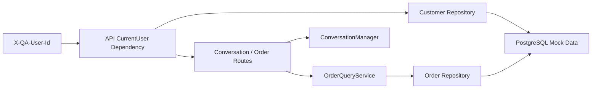

# QA-agent Phase 1 身份隔离与模拟订单只读查询设计规格

| 项目 | 内容 |
| --- | --- |
| 状态 | 待审阅 |
| 日期 | 2026-05-26 |
| 展示名称 | `QA-agent` |
| 实际仓库路径 | `E:\myProgram\QA_agent` |
| 对应方案 | `docs/solution/customer-service-multi-agent-solution.md` |
| 对应任务 | `P1-001`、`P1-002`、`P1-003`，并为 `P1-006` 建立底层读取能力 |

## 1. 目标

本规格定义 Phase 1 的第一个可独立验收切片：在不接入真实企业身份系统、不创建售后工单、不引入多智能体编排的前提下，为 `QA-agent` 增加内部试用身份上下文、会话归属隔离和模拟订单只读查询。

该切片解决两个前置问题：

1. 当前 API 可由调用方填写任意 `user_id`，无法作为后续订单和售后流程的安全边界。
2. 售后办理需要订单事实，但在写操作和资格规则上线之前，应先验证订单读取只向资源归属用户开放。

## 2. 命名约定

- 产品名称、README 标题、方案和用户可见文案统一使用 `QA-agent`。
- 实际本地仓库路径 `E:\myProgram\QA_agent` 是文件系统事实，不改写为不存在的路径。
- Python 导入标识不得包含连字符，代码模块和必要技术标识使用 `qa_agent` 或现有包结构。
- Docker 容器名、环境变量名等现有运行标识本切片不做无业务价值的重命名。

## 3. 范围

### 3.1 本切片包含

- 内部试用身份上下文：API 从固定请求头读取当前测试用户，并校验其是否存在且启用。
- 会话所有权隔离：创建、列表、读取和聊天续接均以当前用户为边界。
- 模拟数据：客户、产品和订单的最小数据模型与可重复写入的种子脚本。
- 模拟订单只读查询：当前用户可以列出自己的订单并读取单笔订单详情。
- 底层订单读取服务契约：为后续 `MockOrderTool`/售后流程提供同一授权查询入口。
- 单元/API 测试与显式数据库集成验证命令。

### 3.2 本切片不包含

- 密码登录、JWT、OAuth、RBAC 或生产用户认证。
- 售后资格判断、退换/维修办理、待确认动作或模拟工单写入。
- 将订单查询注册为当前 Agent 可自由选择的工具。
- Supervisor、`AfterSalesAgent` 或 `TroubleshootingAgent` 编排。
- 真实客户数据、真实订单系统或外部业务 API。

## 4. 方案比较与选择

| 方案 | 做法 | 优点 | 风险/代价 | 结论 |
| --- | --- | --- | --- | --- |
| A. 继续由请求体/查询参数传 `user_id` | 保留当前调用方式，订单接口同样接收任意用户 ID | 改动最小 | 完全不能验证资源隔离；后续业务结论不可信 | 拒绝 |
| B. 内部试用请求头身份 + 数据库存量校验 | 使用 `X-QA-User-Id`，仅允许种子客户；所有资源按当前用户过滤 | 能尽早建立授权边界，改造量与一期范围匹配 | 不是生产认证，不可直接暴露真实客户 | 采用 |
| C. 立即建设 JWT/OAuth/RBAC | 一开始实现接近企业级认证授权 | 长期方向正确 | 与模拟订单验证耦合过重，阻塞业务闭环 | 延后至企业化阶段 |

选择方案 B。该身份只代表内部测试身份，不宣称认证强度；它的价值是让服务端权限检查、测试数据隔离和后续工具契约先稳定下来。

## 5. API 与身份边界

### 5.1 身份输入

受保护接口要求请求头：

```http
X-QA-User-Id: customer_alice
```

服务端通过 `mock_customers` 校验用户存在且 `status = 'active'`，再构造只读的 `CurrentUser` 上下文。缺少请求头返回 `401`；未知或停用测试用户返回 `401`。

该请求头明确是内部试用机制。文档应注明：不得将其当作真实客户认证上线。

### 5.2 会话接口调整

| 接口 | 新行为 |
| --- | --- |
| `POST /api/conversations` | 不再由请求体选择 `user_id`；以当前用户创建会话 |
| `GET /api/conversations` | 不再通过 query 查询任意用户；仅列出当前用户会话 |
| `GET /api/conversations/{conversation_id}` | 仅当前用户可读取；非归属或不存在统一返回 `404` |
| `POST /api/chat` | 新建会话时归属于当前用户；续接已有会话前校验归属 |

统一返回 `404` 的原因是避免通过会话 ID 探测其他用户资源存在性。

### 5.3 订单接口

| 接口 | 行为 |
| --- | --- |
| `GET /api/orders` | 返回当前用户的模拟订单列表，可按状态过滤 |
| `GET /api/orders/{order_id}` | 返回当前用户拥有的一笔模拟订单；非归属或不存在统一返回 `404` |

订单接口仅返回售后流程需要的字段，不返回与该模拟流程无关的用户隐私信息。

## 6. 数据设计

PostgreSQL 新增以下模拟数据表，由现有显式 bootstrap 机制创建，并由独立种子脚本以确定性 ID 插入测试数据。

### 6.1 `mock_customers`

| 字段 | 含义 |
| --- | --- |
| `user_id` | 内部测试用户唯一标识，例如 `customer_alice` |
| `display_name` | 展示名称 |
| `status` | `active` 或 `disabled` |
| `created_at` | 创建时间 |

### 6.2 `products`

| 字段 | 含义 |
| --- | --- |
| `product_id` | 产品标识，例如 `X1`、`X2`、`C1`、`G2` |
| `name` | 产品名称 |
| `category` | 门锁、摄像头或网关 |

### 6.3 `mock_orders`

| 字段 | 含义 |
| --- | --- |
| `order_id` | 模拟订单编号 |
| `user_id` | 归属客户，外键到 `mock_customers` |
| `product_id` | 购买产品，外键到 `products` |
| `purchased_at` | 购买日期，为后续资格判断保留 |
| `status` | `delivered`、`completed` 等只读订单状态 |
| `amount` | 模拟金额，仅用于后续售后规则场景 |
| `created_at` | 创建时间 |

种子数据至少包含两个用户，各自拥有不同订单，并覆盖 `X1`、`X2`、`C1`、`G2` 产品。这样测试能够证明跨用户查询被拒绝，而不是因数据库只有一个用户而误判通过。

## 7. 组件边界



| 组件 | 责任 |
| --- | --- |
| API 身份依赖 | 解析请求头、获得 `CurrentUser`、拒绝无效身份 |
| Customer Repository | 读取内部测试客户，不负责 HTTP 状态码 |
| ConversationManager/路由 | 在服务端基于当前用户执行会话创建和归属检查 |
| Order Repository | 仅执行按 `user_id` 过滤的订单读取查询 |
| OrderQueryService | 构造业务可用的只读订单 DTO，作为后续工具的复用入口 |
| 后续 `MockOrderTool` | 在售后流程设计确认后调用 `OrderQueryService`；本切片不注册到 Agent |

## 8. 授权与错误处理

| 场景 | API 结果 | 记录要求 |
| --- | --- | --- |
| 缺少 `X-QA-User-Id` | `401` | 不记录敏感内容 |
| 用户不存在或已禁用 | `401` | 可记录匿名认证失败计数 |
| 用户读取他人会话 | `404` | 后续审计任务记录风险事件 |
| 用户读取他人订单 | `404` | 后续审计任务记录风险事件 |
| 数据库不可用 | `503` 或现有统一服务失败响应 | `/health` 已能反映依赖状态 |

本切片不通过 LLM 执行权限判断。所有归属过滤必须发生在服务端查询或确定性服务中。

## 9. 测试与验收

### 9.1 离线单元/API 测试

- 缺少、未知、停用的测试用户不能访问受保护接口。
- 创建会话自动使用当前用户，调用方不能指定其他用户。
- 当前用户只能列出和读取自己的会话。
- 聊天请求不能续接其他用户会话。
- 当前用户只能列出和读取自己的模拟订单。
- `OrderQueryService` 输出仅含约定只读字段，且查询始终带当前 `user_id`。

### 9.2 本地数据库集成验证

- 执行 schema bootstrap 和种子脚本后，存在两个测试用户和覆盖四类产品的订单。
- 使用两个用户分别调用订单接口，只能读取各自订单。
- Phase 0 已有的 Agent、引用、健康检查测试保持通过。

### 9.3 完成判定

本切片完成后可将 `P1-001`、`P1-002`、`P1-003` 标为完成；`P1-006` 仅完成底层只读能力准备，需在售后流程将授权订单能力接入受控 Tool 契约后再关闭。

## 10. 后续顺序

1. 在本切片通过后，实现售后政策分类与确定性资格规则。
2. 再增加待确认动作及模拟工单写入，保证未确认时不存在写操作。
3. 完成单 Agent 内的售后闭环和审计后，才规划 Supervisor/子 Agent 拆分。

该顺序保留了最终企业级多智能体方向，但先以可验证的数据隔离和业务事实作为基础。
