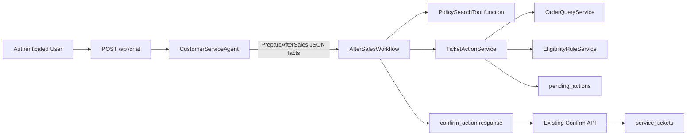

# QA-agent Phase 1 售后 Workflow 与对话接入设计规格

| 项目 | 内容 |
| --- | --- |
| 状态 | 已按总体方案授权细化 |
| 日期 | 2026-05-27 |
| 展示名称 | `QA-agent` |
| 对应方案 | `docs/solution/customer-service-multi-agent-solution.md` |
| 对应任务 | `P1-012`、`P1-015`、`P1-017`（协议接入部分） |

## 1. 目标

本切片将已验证的授权订单、政策检索、资格规则和受控工单写入能力接入用户对话链路，使内部试用用户可以通过 `/api/chat` 获得售后办理的待确认动作，并通过已有确认接口幂等创建模拟工单。

本轮采用单 Agent 内部流程编排，不创建领域子 Agent。`CustomerServiceAgent` 继续承担对话控制，只新增一项受控业务动作 `PrepareAfterSales`；确定性规则、政策依据和写操作仍由服务层承担。

## 2. 范围

### 2.1 包含

- `AfterSalesWorkflow`，组合政策检索与 `TicketActionService.create_action`。
- `CustomerServiceAgent` 新增 `PrepareAfterSales[JSON 显式事实]` 动作分派能力。
- `/api/chat` 的 `confirm_action` 响应类型及 `pending_action` 返回字段。
- 会话元数据记录 `intent=after_sales`、`workflow=after_sales` 和 `awaiting_confirmation` 状态。
- 单元测试、API 测试和本地数据库确认链路验证。

### 2.2 不包含

- 独立的 `AfterSalesAgent`、`TroubleshootingAgent` 或多 Agent 调度。
- 通过自然语言“确认”绕开既有确认端点；确认仍使用 `POST /api/conversations/{conversation_id}/actions/{action_id}/confirm`。
- 工单查询、审计表、转人工记录持久化或管理侧功能。
- 真实售后系统、退款、换货或维修写操作。

## 3. 方案选择

| 方案 | 做法 | 优点 | 风险/代价 | 结论 |
| --- | --- | --- | --- | --- |
| A. 在现有 Agent 增加受控 Workflow 动作 | LLM 选择 `PrepareAfterSales`，Workflow 调用确定性服务生成动作 | 最小改动；复用现有 `/chat`；保留写操作门禁 | LLM 仍负责提取显式字段，需规则层兜底 | 采用 |
| B. 新增独立售后表单 API，不接入聊天 | 客户端直接调用售后流程接口 | 最易控制输入 | 不能完成方案所需对话闭环，重复现有动作 API | 拒绝 |
| C. 直接创建 Supervisor 与领域子 Agent | 新建路由 Agent 并调用售后 Agent | 结构接近长期目标 | 在闭环未稳定前增加推理与调试成本 | 延后 |

## 4. 组件边界



| 组件 | 责任 | 不承担的责任 |
| --- | --- | --- |
| `CustomerServiceAgent` | 从模型动作选择流程、传递当前身份和会话、返回结构化响应 | 判定资格、直接写工单 |
| `AfterSalesWorkflow` | 要求政策依据、调用待确认动作服务、将领域结果映射成用户响应 | 解析任意自由文本规则、确认建单 |
| `TicketActionService` | 授权订单读取、确定性资格校验、创建待确认动作 | 对话组织、政策检索 |
| 确认 API | 在用户明确确认后执行既有幂等建单事务 | 重新选择办理类型 |

## 5. Agent 动作协议

系统提示新增允许动作：

```text
Action: PrepareAfterSales[{"order_id":"ORD-A-C1","request_type":"warranty_repair","issue_cause":"non_human_fault","packaging_intact":null,"issue_summary":"摄像头无法开机"}]
```

字段要求：

| 字段 | 要求 |
| --- | --- |
| `order_id` | 用户明确提供或对话已确认的订单号 |
| `request_type` | `return_or_exchange`、`warranty_repair`、`paid_repair` 之一 |
| `issue_cause` | `non_human_fault`、`human_damage`、`unknown` 之一；未知时流程应澄清 |
| `packaging_intact` | 退换规则需要；其它办理可为 `null` |
| `issue_summary` | 用户可见的问题摘要 |

Agent 不得从 `PrepareAfterSales` 直接返回“已建单”。该动作只可能生成待确认动作、澄清、无法办理说明或人工路径。

现有动作继续表示其当前对话路线：

| 动作 | 路线 |
| --- | --- |
| `search_faq` / `Finish` | 咨询或知识回答 |
| `AskUser` | 排障或办理信息补充 |
| `PrepareAfterSales` | 售后办理流程 |
| `Handoff` | 转人工路径 |

因此 `P1-012` 在本切片实现为单 Agent 内部流程动作接口，不实施 Phase 2 的子 Agent 拆分。

## 6. Workflow 契约

### 6.1 输入

`AfterSalesWorkflow.prepare(current_user, conversation_id, payload)` 接收服务端解析出的 JSON 字段，并构造 `TicketActionInput`。输入不包含用户身份、资格结论、动作 ID 或工单 ID。

### 6.2 执行顺序

1. 校验 JSON 必需字段和枚举值；信息不足时返回 `ask_user`。
2. 通过注入的政策检索函数检索本次办理政策。
3. 若政策结果没有 `Doc5-售后与保修政策` 引用，返回 `handoff`，不创建动作。
4. 调用 `TicketActionService.create_action(current_user.user_id, conversation_id, input)`。
5. 授权订单不存在时返回 `ask_user`，不披露其它用户订单存在性。
6. 资格为 `requires_clarification` 时返回 `ask_user`。
7. 资格不支持用户明确申请或仅建议其它办理路径时返回 `final_answer`，不得自动创建替代动作。
8. 成功时返回 `confirm_action`，附政策引用和服务端创建的 `pending_action`。

### 6.3 响应模型

成功待确认响应经 `/api/chat` 返回：

```json
{
  "type": "confirm_action",
  "content": "根据售后政策，您的申请符合办理条件。请确认是否提交模拟售后工单。",
  "conversation_id": "conversation_uuid",
  "citations": [
    {
      "source_id": "Doc5-售后与保修政策",
      "title": "Doc5-售后与保修政策",
      "section": "保修条款",
      "excerpt": "产品在保修期内出现非人为质量问题，可申请免费维修。"
    }
  ],
  "pending_action": {
    "action_id": "action_uuid",
    "action_type": "create_service_ticket",
    "display_summary": "为订单 ORD-A-C1 创建保修维修工单",
    "expires_at": "2026-05-27T12:30:00"
  },
  "metadata": {
    "intent": "after_sales",
    "workflow": "after_sales"
  }
}
```

## 7. 错误与安全处理

| 场景 | Workflow 响应 | 写入行为 |
| --- | --- | --- |
| 必要字段缺失或故障原因未知 | `ask_user` | 不生成动作/工单 |
| 没有可验证政策引用 | `handoff` | 不生成动作/工单 |
| 当前用户不可访问订单 | `ask_user` | 不泄露、不生成动作 |
| 申请类型不符合资格或规则仅建议替代路径 | `final_answer` | 不自动生成动作 |
| 符合规则且政策有依据 | `confirm_action` | 仅生成待确认动作 |
| 用户确认已生成动作 | 由既有确认 API 返回 `final_answer` | 幂等生成一张工单 |

Workflow 不捕获不可预期的基础设施异常为成功响应。数据库或依赖异常继续由 API 的现有异常路径暴露为失败。

## 8. 测试与验收

### 8.1 Workflow 单元测试

- 有政策引用且资格满足时，调用待确认服务并返回 `confirm_action`。
- 无政策引用时返回 `handoff` 且不调用动作服务。
- 信息不足时返回 `ask_user`。
- 授权订单不存在时返回不披露归属的 `ask_user`。
- 仅存在替代办理建议时返回说明，不生成动作。

### 8.2 Agent 与 API 测试

- `PrepareAfterSales` 将当前用户和当前会话传给 Workflow。
- Agent 对售后待确认结果写入 `awaiting_confirmation` 可见状态，不将其当作工单成功。
- `/api/chat` 接受并返回 `confirm_action`、政策引用和 `pending_action`。
- 现有咨询、澄清、转人工、权限与确认 API 回归保持通过。

### 8.3 本地验证

- 使用真实 PostgreSQL 与替身政策引用运行：Workflow 创建动作后工单为零；调用确认 API 背后的事务服务两次后仍只有一张工单。
- 默认测试不调用真实 LLM 或外部 Embedding 服务。

## 9. 完成判定

验证证据齐备后：

- `P1-012` 标记为 `✅ DONE`：单 Agent 具备咨询、澄清/排障、售后和转人工的流程动作接口；子 Agent 拆分留在 Phase 2。
- `P1-015` 标记为 `✅ DONE`：售后对话可以生成服务端待确认动作，并复用确认端点完成模拟建单闭环。
- `P1-017` 只记录 `/api/chat` 售后协议接入已完成的部分进展，保持未关闭，直至其它业务流程和工单读取接口齐备。

后续优先补齐咨询/排障闭环、转人工记录与权限/流程自动化验收，不提前引入多 Agent。
