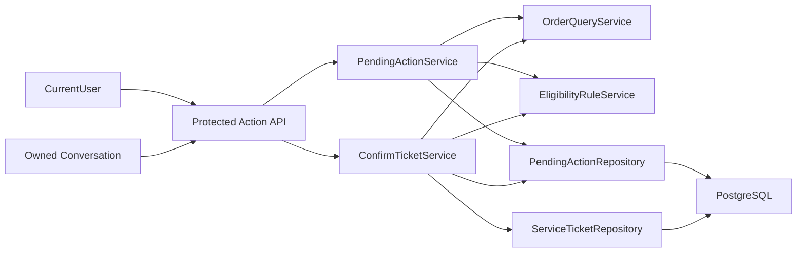

# QA-agent Phase 1 待确认动作与模拟工单写入设计规格

| 项目 | 内容 |
| --- | --- |
| 状态 | 待落盘复核 |
| 日期 | 2026-05-27 |
| 展示名称 | `QA-agent` |
| 实际仓库路径 | `E:\myProgram\QA_agent` |
| 对应方案 | `docs/solution/customer-service-multi-agent-solution.md` |
| 对应任务 | `P1-004`、`P1-009` |

## 1. 目标

本规格定义 Phase 1 的第三个可独立验收切片：在已有授权订单工具、售后政策依据和确定性资格规则之上，建立服务端待确认动作与经确认后创建模拟售后工单的受控写入基础。

该切片只解决写操作安全边界：

1. 符合资格的办理建议必须先持久化为绑定用户与会话的待确认动作。
2. 工单创建必须由确认动作驱动，并在执行时重新校验授权和资格。
3. 重复确认必须幂等返回同一张模拟工单，不得重复建单。

## 2. 范围

### 2.1 本切片包含

- `pending_actions` 数据表与持久化访问，用于保存服务端生成的待确认写操作。
- `service_tickets` 数据表与持久化访问，用于保存经确认创建的模拟售后工单。
- 创建模拟工单待确认动作的领域服务。
- 确认动作并幂等创建模拟工单的领域服务/工具边界。
- 两个受保护 API：创建待确认动作、确认执行待确认动作。
- schema/bootstrap、离线权限/幂等测试与本地 PostgreSQL 集成验证。

### 2.2 本切片不包含

- 聊天 Agent 自动调用资格判断、创建动作或返回 `confirm_action`。
- `AfterSalesWorkflow`、Supervisor 路由或多智能体编排。
- 工单查询 API、管理侧读取接口、完整审计模型或人工转接。
- 真实退货、退款、换货、维修或外部系统写操作。

## 3. 方案选择

| 方案 | 做法 | 优点 | 风险/代价 | 结论 |
| --- | --- | --- | --- | --- |
| A. 持久化待确认动作 + 事务化模拟工单创建 | 动作和工单均入库，确认接口校验并事务写入 | 能验证权限、过期和幂等；符合方案 | 需要增加 schema 与写服务 | 采用 |
| B. 动作以内存保存，工单入库 | 仅工单可持久化 | 实现较少 | 重启后动作消失，无法稳定确认或复盘 | 拒绝 |
| C. 客户端直接提交订单/资格参数创建工单 | 不保存待确认动作 | 接口数量少 | 客户端可重组服务端结论，无法证明用户确认内容 | 拒绝 |

采用方案 A。待确认动作是服务端生成并可验证的业务事实，不允许客户端重新拼装后直接写入工单。

## 4. 组件边界



| 组件 | 责任 | 不承担的责任 |
| --- | --- | --- |
| `PendingActionService` | 依据当前用户、当前会话、授权订单与合格规则结论创建动作 | 创建工单、调用 LLM |
| `ConfirmTicketService` | 校验动作、重算资格、事务化建单和回填执行状态 | 自由选择订单或覆盖规则结论 |
| `PendingActionRepository` | 持久化及读取/锁定动作 | HTTP 权限语义 |
| `ServiceTicketRepository` | 创建并返回模拟工单 | 资格判断 |
| API 路由 | 解析当前身份、校验会话归属、映射 HTTP 响应 | 在路由中实现资格规则 |

## 5. 数据模型

### 5.1 `pending_actions`

| 字段 | 约束与用途 |
| --- | --- |
| `action_id` | UUID 文本主键 |
| `conversation_id` | 非空，关联现有会话 |
| `user_id` | 非空，绑定动作所属内部试用用户 |
| `action_type` | 非空；本切片仅允许 `create_service_ticket` |
| `order_id` | 非空，指向已授权模拟订单 |
| `ticket_type` | 非空，`return_or_exchange`、`warranty_repair` 或 `paid_repair` |
| `eligibility_code` | 创建动作时的合格规则代码 |
| `eligibility_payload` | JSONB，保存重算资格所需明确输入 |
| `issue_summary` | 用户问题摘要，供工单保存和确认展示 |
| `display_summary` | 用户确认时展示的服务端摘要 |
| `status` | `pending`、`executed`、`expired`、`cancelled` |
| `expires_at` | 非空，动作有效期 |
| `executed_ticket_id` | 可空，成功建单后回填 |
| `created_at` / `updated_at` | 审计时间 |

### 5.2 `service_tickets`

| 字段 | 约束与用途 |
| --- | --- |
| `ticket_id` | UUID 文本主键 |
| `user_id` | 非空，工单归属用户 |
| `order_id` | 非空，关联模拟订单 |
| `ticket_type` | 非空，办理路径 |
| `issue_summary` | 非空，服务端确认动作中的问题摘要 |
| `eligibility_code` | 非空，工单创建依据 |
| `status` | 非空；初始仅使用 `submitted` |
| `created_at` / `updated_at` | 时间字段 |

数据库应为 `pending_actions.executed_ticket_id` 与工单建立稳定关联，并保证确认执行过程中不存在一个动作产生多张工单的可见状态。

## 6. 创建动作契约

### 6.1 输入

创建动作 API 使用当前受保护身份和路径会话，客户端只提交办理事实：

```json
{
  "order_id": "ORD-A-C1",
  "request_type": "warranty_repair",
  "issue_cause": "non_human_fault",
  "packaging_intact": null,
  "issue_summary": "摄像头无法开机"
}
```

服务端必须：

1. 校验 `conversation_id` 属于当前用户。
2. 通过 `OrderQueryService` 读取当前用户拥有的订单。
3. 用服务端当前日期调用 `EligibilityRuleService` 计算资格。
4. 仅当 `eligible=True` 且 `recommended_service` 为允许工单类型时创建动作。
5. 保存规则重算所需的输入和创建时的资格代码，不接收客户端提供的资格结论。

### 6.2 输出

成功创建动作返回：

```json
{
  "type": "confirm_action",
  "content": "请确认是否提交模拟保修维修工单。",
  "conversation_id": "conversation_uuid",
  "pending_action": {
    "action_id": "action_uuid",
    "action_type": "create_service_ticket",
    "display_summary": "为订单 ORD-A-C1 创建保修维修工单",
    "expires_at": "2026-05-27T10:00:00+08:00"
  }
}
```

本返回仅表示存在待确认动作，不表示工单已创建或业务已受理。

## 7. 确认执行契约

确认请求为：

```http
POST /api/conversations/{conversation_id}/actions/{action_id}/confirm
X-QA-User-Id: customer_alice
```

服务端按以下顺序执行：

1. 校验当前用户拥有该 `conversation_id`；不存在或越权统一返回 `404`。
2. 在事务中读取并锁定属于该用户和会话的 `action_id`；不存在或越权统一返回 `404`。
3. 校验 `action_type == "create_service_ticket"`。
4. 若动作状态为 `executed` 且已有 `executed_ticket_id`，返回原工单结果并标记为幂等重试。
5. 若动作已过期或取消，拒绝执行，不创建工单。
6. 按动作保存的订单号重新执行当前用户授权订单读取。
7. 按动作保存的明确输入与确认日重新运行 `EligibilityRuleService`。
8. 只有重新计算结果仍允许该 `ticket_type` 时，创建一张 `service_tickets` 记录并将动作更新为 `executed`。
9. 工单创建与动作状态更新在同一数据库事务中完成；失败时不宣称成功。

确认首次成功结果应包含：

```json
{
  "type": "final_answer",
  "content": "模拟售后工单已提交。",
  "conversation_id": "conversation_uuid",
  "ticket": {
    "ticket_id": "ticket_uuid",
    "order_id": "ORD-A-C1",
    "ticket_type": "warranty_repair",
    "status": "submitted"
  },
  "idempotent_replay": false
}
```

重复确认已执行动作返回同一张工单，且 `idempotent_replay` 为 `true`。

## 8. API 与错误处理

| 接口 | 行为 |
| --- | --- |
| `POST /api/conversations/{conversation_id}/actions` | 创建服务端待确认动作，不创建工单 |
| `POST /api/conversations/{conversation_id}/actions/{action_id}/confirm` | 确认并幂等创建一张模拟工单 |

| 场景 | HTTP/业务行为 |
| --- | --- |
| 会话非归属或不存在 | `404` |
| 订单非归属或不存在 | `404`，不生成动作 |
| 资格输入不足 | `409`，返回 `requires_clarification`，不生成动作 |
| 资格不满足办理 | `409`，返回规则代码，不生成动作 |
| 动作非归属或不存在 | `404` |
| 动作过期或已取消 | `409`，不建单 |
| 动作已成功执行 | `200`，返回既有工单和 `idempotent_replay=true` |
| 确认时资格已失效 | `409`，不建单 |
| 数据库执行失败 | 不返回成功结果；沿用现有错误处理或映射可恢复服务错误 |

## 9. 事务与幂等边界

- 动作生成时不写入工单。
- 确认执行必须在单次事务中锁定动作、创建工单并回填动作。
- 动作的 `executed_ticket_id` 是重复确认返回原结果的依据。
- 确认服务不得接收客户端直接提供的 `ticket_id`、`eligibility_code` 或替代订单归属信息。
- 未实现审计表前，通过动作和工单持久化字段保留本切片最低限度的可追踪业务事实。

## 10. 测试与验收

### 10.1 单元/API 测试

- 创建动作仅接受当前用户拥有的会话和订单。
- 资格不足或不符合时不创建待确认动作。
- 创建动作完成后，工单表仍没有新记录。
- 确认错误用户或错误会话的动作统一不可访问。
- 过期/取消动作不会创建工单。
- 确认时重新计算资格；不再满足规则时不创建工单。
- 首次确认仅创建一张工单；再次确认返回同一工单。

### 10.2 本地数据库验证

- schema bootstrap 可创建 `pending_actions` 与 `service_tickets`。
- 使用内部试用用户、已归属会话和合格订单完成“创建动作 -> 工单数仍为零 -> 确认 -> 一张工单 -> 重复确认仍为一张工单”验证。
- 现有 `P1-006` 至 `P1-008`、身份隔离、Agent 基线回归均保持通过。

### 10.3 完成判定

验证证据齐备后：

- `P1-004` 可标记为 `✅ DONE`，因为工单和待确认动作数据基础已完成。
- `P1-009` 可标记为 `✅ DONE`，因为确认后幂等创建工具/API 边界已验证。

以下任务保持未完成：

- `P1-010` 工单查询工具。
- `P1-012` 至 `P1-017` 对话流程和用户侧完整协议编排。
- `P1-005` 与管理/审计相关任务。

## 11. 后续顺序

1. 基于已验证的订单、政策、规则与受控工单写入，设计售后 Workflow 及用户侧对话协议接入。
2. 并行规划最小审计记录，确保流程接入后工具调用和写操作可复盘。
3. 仅在单 Agent 流程稳定后评估 Supervisor 与领域子 Agent 拆分。
