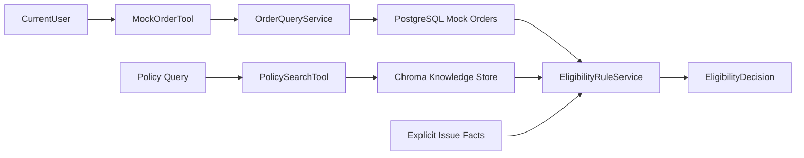

# QA-agent Phase 1 售后政策、资格规则与授权工具设计规格

| 项目 | 内容 |
| --- | --- |
| 状态 | 待落盘复核 |
| 日期 | 2026-05-27 |
| 展示名称 | `QA-agent` |
| 实际仓库路径 | `E:\myProgram\QA_agent` |
| 对应方案 | `docs/solution/customer-service-multi-agent-solution.md` |
| 对应任务 | `P1-006`、`P1-007`、`P1-008` |

## 1. 目标

本规格定义 Phase 1 的第二个可独立验收切片：在已有内部试用身份、会话隔离和模拟订单只读服务之上，提供售后政策结构化检索、当前用户授权订单工具和确定性售后资格规则。

该切片的目标是让后续售后办理流程能够依赖可验证的三个事实来源：

1. 当前用户可访问的订单事实。
2. `Doc5-售后与保修政策` 中的适用政策依据。
3. 不依赖 LLM 的结构化资格结论。

## 2. 范围

### 2.1 本切片包含

- 独立的售后政策检索入口，仅返回售后政策文档的结构化来源。
- `MockOrderTool`，绑定服务端提供的当前内部试用用户，只读取其可访问订单。
- `EligibilityRuleService`，根据订单日期、申请类型及明确的故障/商品状态输入输出确定性结论。
- 至少一笔超过一年购买时间的模拟订单，用于过保付费维修路径验证。
- 离线单元测试、已有身份/订单隔离回归测试和 worklist 证据更新。

### 2.2 本切片不包含

- 待确认动作、模拟售后工单数据表或任何写操作。
- `confirm_action` 响应或“已受理”“已建单”等办理成功承诺。
- 将新增工具接入当前通用聊天 Agent 或构建售后 Workflow。
- Supervisor 路由、多智能体拆分、审计模型和管理侧接口。
- 延保、电池、物流争议、换新保修重算等自动资格判定。

## 3. 方案选择

| 方案 | 做法 | 优点 | 风险/代价 | 结论 |
| --- | --- | --- | --- | --- |
| A. 领域服务与独立受控工具薄封装 | 政策工具、授权订单工具、资格规则服务各自承担单一职责 | 符合总体方案；容易测试；后续 Workflow 可直接复用 | 新增少量领域类型与模块 | 采用 |
| B. 扩展通用 FAQ 工具并在 API 路由判规则 | 在现有工具和路由中快速追加逻辑 | 文件较少 | 政策检索与规则边界混杂，后续需重拆 | 拒绝 |
| C. 同时实现完整售后闭环 | 一次加入确认动作和工单创建 | 更早展示完整流程 | 写操作、幂等和审计尚未设计，扩大风险 | 延后 |

采用方案 A。该方案保持 `Tool/Service` 承担确定性能力，避免模型自行产生业务承诺，也不提前引入写操作。

## 4. 组件边界



| 组件 | 责任 | 不承担的责任 |
| --- | --- | --- |
| `PolicySearchTool` | 检索售后政策内容并返回结构化引用 | 给出资格结论、创建办理动作 |
| `MockOrderTool` | 读取绑定当前用户的订单事实 | 接受调用方指定任意用户、修改订单 |
| `OrderQueryService` | 复用既有按用户过滤的订单读取逻辑 | 推断售后资格 |
| `EligibilityRuleService` | 按显式输入计算资格代码和政策章节 | 调用 LLM、生成工单、覆盖授权边界 |

本切片不把工具注册给当前 `CustomerServiceAgent`。工具及服务先形成可测试契约，后续由售后 Workflow 统一编排。

## 5. 政策检索契约

保留现有 `search_faq` 用于通用知识问答，新增仅面向售后政策的检索工具。工具可复用现有向量检索底座，但输出的有效引用必须来源于 `Doc5-售后与保修政策`。

成功结果沿用已有结构化引用协议：

```python
ToolResult(
    content="...",
    citations=[
        Citation(
            source_id="doc5-after-sales-policy",
            title="Doc5-售后与保修政策",
            section="保修条款",
            excerpt="...",
        )
    ],
)
```

若检索不到有效政策来源，工具返回无引用的 `ToolResult`。后续流程必须将这种结果视为依据不足，不得用规则服务或模型补造政策依据。

## 6. 授权订单工具契约

`MockOrderTool` 由应用或后续 Workflow 以服务端身份上下文构造，调用时不接收 `user_id`。工具参数只包含业务所需的订单号：

```python
get_mock_order(order_id="ORD-A-X1")
```

内部执行行为为：

```python
order_service.get_order(current_user.user_id, order_id)
```

工具结果应提供资格判断所需的订单字段，包括订单号、产品、购买日期和订单状态。未找到订单或订单不属于当前用户时，工具统一返回不可访问/未找到语义，不暴露该订单是否属于其他用户。

## 7. 资格规则契约

### 7.1 输入

```python
EligibilityRequest(
    order=OrderView(...),
    request_type="return_or_exchange" | "warranty_repair" | "paid_repair",
    issue_cause="non_human_fault" | "human_damage" | "unknown",
    packaging_intact=True | False | None,
    evaluated_on=date(...),
)
```

其中：

- `order` 必须来自授权订单查询，不接受未授权订单事实。
- `request_type` 仅覆盖本切片三种售后路径。
- `issue_cause` 表达规则必需的明确事实，不要求规则服务推断用户自然语言。
- `evaluated_on` 显式传入，保证日期边界可重复测试。

### 7.2 输出

```python
EligibilityDecision(
    code="eligible_for_return_or_exchange",
    eligible=True,
    recommended_service="return_or_exchange",
    reason_codes=["within_7_days", "packaging_intact", "not_human_damaged"],
    policy_sections=["退换货政策"],
)
```

`eligible` 仅表示规则路径是否满足政策条件。对于过保订单，结论表示可进入付费维修咨询/检测路径，不表示已批准维修、已确认报价或已完成办理。

## 8. 规则边界

本切片仅把政策原文中能够确定性执行的规则编码。购买日到评估日按自然日差值计算：

| 场景 | 必要输入 | 结构化结论 | 政策来源 |
| --- | --- | --- | --- |
| `0-7` 天申请退换，未经人为损坏且包装完好 | `return_or_exchange`、`non_human_fault`、`packaging_intact=True` | `eligible_for_return_or_exchange` | 退换货政策 |
| `0-7` 天申请退换，但人为损坏或包装不完好 | 明确损坏/包装事实 | `ineligible_for_return_or_exchange` | 退换货政策 |
| `8-365` 天且为非人为功能故障 | `warranty_repair`、`non_human_fault` | `eligible_for_warranty_repair` | 保修条款；维修和退换有什么区别 |
| 保修期内但明确为人为损坏 | `human_damage` | `ineligible_for_free_warranty`，建议付费维修路径 | 保修条款 |
| `>365` 天 | 订单日期事实 | `paid_repair_available` | 过保后维修怎么收费 |
| 判断必要事实缺失 | `unknown` 或退换缺少包装状态 | `requires_clarification` | 不生成办理结论 |

以下政策仍可被检索，但不在本轮资格自动判定中：延保服务、电池质量缺陷、上门维修费用、寄修物流争议、换新后的保修重算。

## 9. 错误处理

| 场景 | 处理 |
| --- | --- |
| 政策检索无有效 `Doc5` 引用 | 返回无引用结果，上层后续澄清或转人工 |
| 查询不存在或不属于当前用户的订单 | 返回统一未找到/不可访问语义，不泄露归属 |
| 资格请求类型不受支持 | 返回 `requires_clarification` 或输入校验失败，不生成合格结论 |
| 退换缺少包装状态、故障原因未知 | 返回 `requires_clarification` |
| 过保进入付费维修路径 | 不返回具体报价确认或办理成功信息 |

## 10. 数据与测试设计

### 10.1 模拟数据

现有数据已覆盖购买 `0-7` 天及 `8-365` 天的订单。新增至少一笔购买超过 `365` 天的订单，并保持数据只属于其明确的模拟用户，用于过保场景和授权隔离验证。

### 10.2 离线测试

| 对应任务 | 验证内容 |
| --- | --- |
| `P1-006` | `MockOrderTool` 只通过绑定用户读取订单；调用参数无法选择其他用户；未授权订单不披露 |
| `P1-007` | 政策工具只返回 `Doc5` 来源；无有效来源时结果没有引用 |
| `P1-008` | 覆盖合格退换、免费保修、人为损坏、过保付费路径和事实不足澄清 |

### 10.3 回归验证

- 身份上下文、会话归属和订单只读 API 测试保持通过。
- Phase 0 的 Agent 动作、引用和健康检查测试保持通过。
- 默认验证不得调用真实 LLM 或 Embedding API。

## 11. 完成判定与后续顺序

当新增测试和完整离线回归提供证据后：

- `P1-006` 可标记为 `✅ DONE`，因为授权订单读取能力已从 Service/API 延伸为受控工具。
- `P1-007` 可标记为 `✅ DONE`，因为产品知识和售后政策具备独立检索能力及结构化来源。
- `P1-008` 可标记为 `✅ DONE`，因为政策覆盖范围内的资格规则得到确定性实现与测试。

后续顺序固定为：

1. 设计并实现 `P1-004` 与 `P1-009` 的待确认动作和模拟工单写入。
2. 在写操作受控后，设计售后 Workflow 以编排订单、政策、规则和工单能力。
3. 售后闭环与审计稳定后，再进入 Supervisor 和领域子 Agent 拆分。

本切片不关闭任何写操作、流程编排或多智能体任务。
